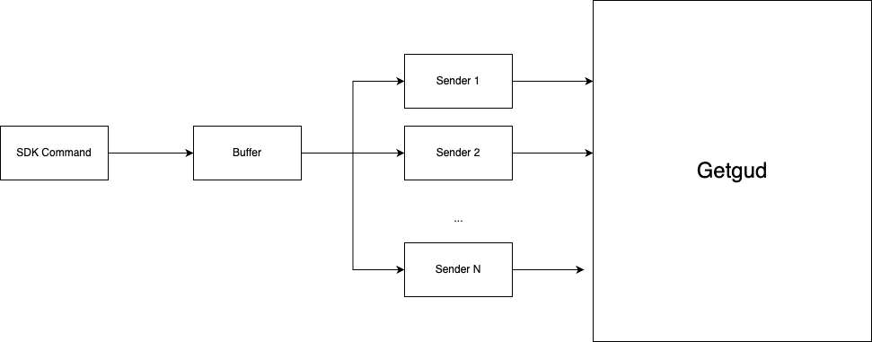

# GetGud C++ SDK
Getgud C++ SDK allows you to integrate your game with the GetGud platform. Once integrated, you will be able to stream your matches to Getgud's cloud, as well as to send reports and update player's data.

## Table of Contents

- [Prerequsites](https://github.com/getgud-io/cpp-getgud-sdk#prerequisites)
- [How SDK works](https://github.com/getgud-io/cpp-getgud-sdk#how-sdk-works)
- [Getting Started](https://github.com/getgud-io/cpp-getgud-sdk#getting-started)
- [Configuration](https://github.com/getgud-io/cpp-getgud-sdk#configuration)
    - [Description of the Config fields](https://github.com/getgud-io/cpp-getgud-sdk#description-of-the-config-fields)
- [Logging](https://github.com/getgud-io/cpp-getgud-sdk#logging)
- [Usage](https://github.com/getgud-io/cpp-getgud-sdk#usage)
    - [Initialization](https://github.com/getgud-io/cpp-getgud-sdk#initialization)
    - [Starting Games and Matches](https://github.com/getgud-io/cpp-getgud-sdk#starting-games-and-matches)
    - [Adding Actions to live Match](https://github.com/getgud-io/cpp-getgud-sdk#adding-actions-to-live-match)
    - [Adding Chat messages and Reports to live Match](https://github.com/getgud-io/cpp-getgud-sdk#adding-chat-and-reports-to-live-match)
    - [Ending Games and Matches](https://github.com/getgud-io/cpp-getgud-sdk#ending-games-and-matches)
    - [Sending Reports to past Matches](https://github.com/getgud-io/cpp-getgud-sdk#sending-reports-to-finished-matches)
    - [Sending Player Updates](https://github.com/getgud-io/cpp-getgud-sdk#sending-player-updates)
    - [Disposing the SDK](https://github.com/getgud-io/cpp-getgud-sdk#disposing-the-sdk)
- [Examples](https://github.com/getgud-io/cpp-getgud-sdk#examples)

## Prerequisites

To start, let’s talk about the logical structure of how the Getgud SDK is built.

**Titles->1->N->Games->1->N->Matches**


* The top container in Getgud's SDK is `Title`, which represents a literal game’s title, you as a client can have many titles, for example, a `Title` named CS:GO represents the CS:GO video game.  Title holds an Id, PII, permissions, etc. 

  ```
  Example of Title: CS:GO 
  ```

* Next up is `Game`, it is a container of matches that belong to the same `Title` from the same server session, where mostly the same players in the same teams, play one or more `Matches` together. You as a client can identify every game with a unique `gameGuid` that is provided to you once the `Game` starts. 

  ```
  An example of a Game is a CS:GO Game which has 30 macthes (AKA rounds) inside it.
  ```

* `Match` represents the actual play time that is streamed for analysis.  Like `Game`, `Match` also has a GUID which will be provided to you once you start a new match.

  ```
  An example of a Match is a single CS:GO round inside the game.
  ```

* The `Player` entity represents a literal player and holds the player’s stats. A Player belongs to a `Title`. Player also has a GUID that is provided by you (your player id).

## Getting Started

To use the GetGud SDK, you will need to include the required header file:

```cpp
#include "../include/GetGudSdk.h"
```

First things first, you need to Init SDK in your code. To do this type:

```cpp
GetGudSdk::Init();
```

This will load the default Config and set up SDK for working. Note that to customize how SDK works you will need to use your own `config.json` file.

Next, you need to start a Game, you can do it like this:

```cpp
std::string gameGuid = GetGudSdk::StartGame(
  1, //titleId
  "6a3d1732-8f72-12eb-bdef-56d89392f384", //privateKey
  "us-west-1", // serverGuid
  "deathmatch" // gameMode
);
```

Once the Game is started you get the Game guid and you can start the Match using your gameGuid.

```cpp
std::string matchGuid = GetGudSdk::StartMatch(
  gameGuid, 
  "deathmatch", // matchMode
  "de-dust" // mapName
);
```

When you start the Match you get its matchGuid. Now you can push Action, Chat Data, and Reports to the Match. Let's push a Spawn Action to this match.

```cpp
bool isActionSent = GetGudSdk::SendSpawnAction(
          matchGuid,
          1684059337532,  // actionTimeEpoch
          "player_1", // playerGuid
          "ttr", // characterGuid
          GetGudSdk::PositionF{1, 2, 3}, // position
          GetGudSdk::RotationF{10, 20} // rotation
);
```

Let's also create one more match and push a report.

```cpp
std::string matchGuid = GetGudSdk::StartMatch(
  gameGuid, 
  "deathmatch", // matchMode
  "de-mirage" // mapName
);

GetGudSdk::ReportInfo reportInfo;
reportInfo.MatchGuid = "6a3d1732-8f72-12eb-bdef-56d89392f384";
reportInfo.ReportedTimeEpoch = 1684059337532;
reportInfo.ReporterName = "player1";
reportInfo.ReporterSubType = 0;
reportInfo.ReporterType = 0;
reportInfo.SuggestedToxicityScore = 100;
reportInfo.SuspectedPlayerGuid = "player1";
reportInfo.TbSubType = 0;
reportInfo.TbTimeEpoch = 1684059337532;
reportInfo.TbType = 0;
GetGudSdk::SendInMatchReport(reportInfo);

```

Great, it is time to stop the Game now. To do it just specify what Game you need to stop, all the Matches inside this Game will be stopped automatically.

```cpp
bool gameEnded = GetGudSdk::MarkEndGame(gameGuid);
```

In the end, just dispose SDK when you do not need it anymore.

```cpp
GetGudSdk::Dispose();
```

## How Does The SDK work

To effectively control the SDK it is important to understand how it works. 



In the image, you can see a high-level diagram of what happens when you call any of the SDK commands. The functionality of SDK can be divided into 3 main components which are completely separated from one another.
- Sending live Game Data (Actions, Reports, Chat for live Matches)
- Send Reports for finished Games
- Send Player Update events

Each of those 3 components has a similar structure to what we showed on the graph. 
When you call the command in Getgud SDK the command is then passed to the "Buffer" and one of the Sender threads on the other side picks the command and accumulates it forming the JSON packets that will be at some time point sent to Getgud.

Sending live Game Data is a much more consuming process than Sending Reports and Players, there will be not many events you will send to us, unlike sending live Game Data. With live Game Data, you will send us THOUSANDS of updates per tick. That is why we allow to spawn more than 1 sender only for sending Live Game data, you will see this reflected in the config file.

## Configuration

The Config JSON file is loaded during `GetGudSdk::Init();` operation using `CONFIG_PATH` env variable.
Example of configuration file `config.json`:

```json
{
  "streamGameURL": "http://44.204.78.198:3000/api/game_stream/send_game_packet",
  "updatePlayersURL": "http://44.204.78.198:3000/api/player_data/update_players",
  "sendReportsURL": "http://44.204.78.198:3000/api/report_data/send_reports",
  "throttleCheckUrl": "http://44.204.78.198:3000/api/game_stream/throttle_match_check",
  "logToFile": true,
  "logFileSizeInBytes": 2000000,
  "circularLogFile": true,
  "reportsMaxBufferSizeInBytes": 100000,
  "maxReportsToSendAtOnce": 100,
  "maxChatMessagesToSendAtOnce": 100,
  "playersMaxBufferSizeInBytes": 100000,
  "maxPlayerUpdatesToSendAtOnce": 100,
  "gameSenderSleepIntervalMilliseconds": 100,
  "apiTimeoutMilliseconds": 600,
  "apiWaitTimeMilliseconds": 100,
  "packetMaxSizeInBytes": 2000000,
  "actionsBufferMaxSizeInBytes": 10000000,
  "gameContainerMaxSizeInBytes": 50000000,
  "maxGames": 25,
  "maxMatchesPerGame": 10,
  "minPacketSizeForSendingInBytes": 1000000,
  "packetTimeoutInMilliseconds": 100000,
  "gameCloseGraceAfterMarkEndInMilliseconds": 20000,
  "liveGameTimeoutInMilliseconds": 100000,
  "hyperModeFeatureEnabled": true,
  "hyperModeMaxThreads": 10,
  "hyperModeAtBufferPercentage": 10,
  "hyperModeUpperPercentageBound": 90,
  "hyperModeThreadCreationStaggerMilliseconds": 100,
  "logLevel": "FULL"
}
```

Please note that SDK will not start if `CONFIG_PATH` is not set.
Make sure to adjust the values in the configuration file according to your application's requirements.

### Description of the Config fields

#### General API connection fields
- `streamGameURL`: The link to Getgud API which will be used to send actions, chat, and reports for live matches.
- `updatePlayersURL`: The link to Getgud API which will be used to send Player Update events to Getgud.
- `sendReportsURL`: The link to Getgud API which will be used to send Reports for finished Matches.
- `throttleCheckUrl`: The link to Getgud API which will be used to throttle check each match before sending its actions, reports, and chat to us. It is a way for Getgud to tell SDK if this match is interesting for it or not.
- `logLevel`: Log level setting, in other words, how much you want to log into the log file. 
  - `FULL`: Log everything
  - `WARN_AND_ERROR`: Log all errors and warnings
  - `_ERROR`: Log all errors
  - `FATAL`: Log only fatal errors

- `logToFile`: Weather SDK should write the logs to file or no
- `logFileSizeInBytes`: Maximum log file size in bytes `(0, 100000000)` bytes
- `circularLogFile`: In case this is set to true and the log file size exceeds the limit the SDK will start removing the first lines of the file to push more logs to the end of the log file

#### Offline Report Sending fields
- `reportsMaxBufferSizeInBytes`: Maximum size of the reports buffer in bytes for sending reports for finished matches. If the size of Report buffer fills too quickly all the next reports you send to us will be disregarded. `(0, 10000000)` bytes.
- `maxReportsToSendAtOnce`: Maximum number of reports for offline matches that will be sent to Getgud at once. `(0, 100)` reports.

#### Player Update fields
- `playersMaxBufferSizeInBytes`: Maximum size of the player updates buffer in bytes for sending player updates. If the size of Player Update buffer fills too quickly all the next player updates you send to us will be disregarded. `(0, 10000000)` bytes.
- `maxPlayerUpdatesToSendAtOnce`: Maximum number of player updates that will be sent to Getgud at once. `(0, 100)` reports.

#### Chat messages
- `maxChatMessagesToSendAtOnce`: Maximum amount of chat messages to send at once with game packet. `(0,100)` chat messages.


#### Live Games and Matches fields
- `gameSenderSleepIntervalMilliseconds`: Sleep time of every Game Sender. `(0, 5000)` milliseconds.
- `apiTimeoutMilliseconds`: API timeout in milliseconds, the maximum time the data transfer is allowed to complete. `(0, 20000)` milliseconds.
- `apiWaitTimeMilliseconds`: The SDK will be trying to send the game packet for this time frame. So it will do K attempts to send the packet, each attempt will have a timeout of `apiTimeoutMilliseconds`, and when it fails it will try to send again until the wait time is over. `(0, 20000)` milliseconds.
- `packetMaxSizeInBytes`: Maximum size of a game packet in bytes to send to Getgud. `(0, 2000000)` bytes.
- `actionsBufferMaxSizeInBytes`: Maximum size of the actions buffer in bytes. We use Action Buffer to transfer actions from GetGudSdk to one of the Game Senders. `(500, 100000000)` bytes.
- `gameContainerMaxSizeInBytes`: Maximum size of the game container in bytes. We use Game Container to transfer metadata of Games and Matches to one of the Game Senders. `(500, 500000000)` bytes.
- `maxGames`: Maximum number of live Games allowed at once. `(1, 100)` games.
- `maxMatchesPerGame`: Maximum number of live Matches per live Game. `(1, 100)` matches.
- `minPacketSizeForSendingInBytes`: Minimum size of a packet required for sending to Getgud in bytes. `(500, 1500000)` bytes.
- `packetTimeoutInMilliseconds`: If a live Game is not getting any action in this time frame, the game packet to Getgud will be sent even though its size is less than `minPacketSizeForSendingInBytes`. `(500, 100000)` milliseconds.
- `gameCloseGraceAfterMarkEndInMilliseconds`: Grace period in milliseconds after marking a game as ended before closing it. This is done to accumulate some actions which may still not be in the game packet. `(0, 200000)` milliseconds.
- `liveGameTimeoutInMilliseconds`: If the live game didn't receive any actions for this time in milliseconds we will close it. `(0, 300000)` milliseconds.
- `hyperModeFeatureEnabled`: Flag to enable or disable the hypermode feature. Hyper mode allows spawning more than 1 Game Sender thread in case the Action Buffer or Game Container becomes too large. `true, false`
- `hyperModeMaxThreads`: Maximum number of threads allowed in hypermode. In other words how many Game Senders can we have active. `(1, 20)` threads.
- `hyperModeAtBufferPercentage`: Percentage of buffer usage to trigger hypermode. If action buffer or game container usage is larger than this %, SDK will start spawning extra threads. `(10, 90)` %.
- `hyperModeUpperPercentageBound`: Upper percentage bound for buffer usage in hypermode, at this % usage SDK will have `hyperModeMaxThreads` activated. `(30, 90)` %.
- `hyperModeThreadCreationStaggerMilliseconds`: Time interval between the creation of consecutive threads (Game senders) in hypermode in milliseconds. `(0, 10000)` milliseconds.

## Logging

SDK will log all its actions depending on what `logLevel` you set up in the config file. You should also set up env variable `LOG_FILE_PATH` with the path to the file where SDK will log data, otherwise, the logging will not work.

In order to control how you log use the following config parameters:
```json
"logToFile": true,
"logFileSizeInBytes": 2000000,
"circularLogFile": true,
```

This will allow you to control how much you log and what to do if the log file exceeds the memory limit.

## Usage

### Initialization

#### Init()

Before using the GetGud SDK, you must initialize it:

```cpp
GetGudSdk::Init();
```

This sets up internal components, such as memory management, and network connections, loads config file, starts Logger, and prepares the SDK for use.

### Starting Games and Matches

#### StartGame(titleId, privateKey, serverName, gameMode)

To start a new game, call `StartGame()` with the following parameters:
* titleId : internal titleId from Getgud, provided when you create a new title in Getgud
* privateKey : private key, provided along with the titleId after creating a new title in Getgud
* serverName : name of your game server
* gameMode : mode of the game you are about to start

```cpp
std::string gameGuid = GetGudSdk::StartGame(titleId, privateKey, serverName, gameMode);
```

This will start a new live Game which will accumulate live Matches and once has enough data will send a request to Getgud.

`StartGame` returns `gameGuid` - a unique identifier of the game which you will use later to start new Matches inside the Game as well as to end the Game when it is over.

#### StartGame(serverName, gameMode)

You can also start a live Game using environment variables `TITLE_ID` and `PRIVATE_KEY`, in this case, you do not have to specify `titleId` and `privateKey` as function arguments:

```cpp
std::string gameGuid = GetGudSdk::StartGame(serverName, gameMode);
```

#### StartMatch(gameGuid, matchMode, mapName)

When you have started a live Game you can now attach Matches to the Game.
To start a new match for an existing game, call `StartMatch()`:

```cpp
std::string matchGuid = GetGudSdk::StartMatch(gameGuid, matchMode, mapName);
```

When you start a new live Match you get a `matchGuid`, you will need to use it when you add Actions, Chat Data, and Report Data to this live Match.

A live Match is where you are going to accumulate actions, chat data, and reports for this live Match entity. Remember a single live Game will have one or more live Matches, each match will contain its actions, chat, and reports.

You do not have to Stop the match manually, this is done for you automatically when you `MarkEndGame`


### Adding Actions to live Match

When the live Match is started, you can add Actions, Chat Data, and Reports to this match. There are 6 Action types you can add to the Match. We call them the primal 6 actions. Let's dive into each Action Type.

#### Spawn Action

To add a Spawn Action to a match, use the `SendSpawnAction` function. This marks the Spawn of every `Player` inside the Match.

```cpp
bool SendSpawnAction(std::string matchGuid,
                     long long actionTimeEpoch,
                     std::string playerGuid,
                     std::string characterGuid,
                     int teamId,
                     float initialHealth,
                     PositionF position,
                     RotationF rotation);
```

Here is an example:
```cpp
bool isActionSent = GetGudSdk::SendSpawnAction(
          "6a3d1732-8f72-12eb-bdef-56d89392f384", //matchGuid
          1684059337532,  // actionTimeEpoch
          "player_1", // playerGuid
          "ttr", // characterGuid
          GetGudSdk::PositionF{1, 2, 3}, // position
          GetGudSdk::RotationF{10, 20} // rotation
);
```

The `SpawnActionData` uses the following parameters:

* `matchGuid` - guid of the live Match where the action happened, is given to you when `StartMatch` is called.
* `actionTimeEpoch` - epoch time in milliseconds when the action happened.
* `playerGuid` - guid AKA nickname of the player who is doing this action, max length is 36 chars.
* `characterGuid` - guid of the character from your game, max length is 36 chars.
* `position` - X,Y,Z coordinates of the player at the moment of action.
* `rotation` - PITCH, ROLL rotation of player view at the moment of action.

#### Position Action

To add a Position Action to a match, use the `SendPositionAction` function. This marks the change of `Player` position and view site. You can do this every tick.

```cpp
bool SendPositionAction(std::string matchGuid,
                        long long actionTimeEpoch,
                        std::string playerGuid,
                        PositionF position,
                        RotationF rotation);
```

Here is an example:
```cpp
bool isActionSent =  GetGudSdk::SendPositionAction(
          "6a3d1732-8f72-12eb-bdef-56d89392f384", //matchGuid
          1684059337532,  // actionTimeEpoch
          "player_1", // playerGuid
          GetGudSdk::PositionF{1, 2, 3}, // position
          GetGudSdk::RotationF{10, 20} // rotation
);
```

The `PositionActionData` uses the following parameters:

* `matchGuid` - guid of the live Match where the action happened, is given to you when `StartMatch` is called.
* `actionTimeEpoch` - epoch time in milliseconds when the action happened
* `playerGuid` - guid AKA nickname of the player who is doing this action, max length is 36 chars
* `position` - X,Y,Z coordinates of the player at the moment of action.
* `rotation` - PITCH, ROLL rotation of player view at the moment of action.

#### Attack Action

To add a Attack Action to a match, use the `SendAttackAction` function. An Attack action is any attempt to attack, for example, firing a shot, throwing a grenade, or any other action that may result in damage. Though Attack action is not bound to damage anyone, it is an attempt to cause Damage, not the Damage itself.

```cpp
bool SendAttackAction(std::string matchGuid,
                      long long actionTimeEpoch,
                      std::string playerGuid,
                      std::string weaponGuid);
```

Here is an example:
```cpp
bool isActionSent =  GetGudSdk::SendAttackAction(
          "6a3d1732-8f72-12eb-bdef-56d89392f384", //matchGuid
          1684059337532,  // actionTimeEpoch
          "player_1", // playerGuid
          "akm" // weaponGuid
);
```

The `AttackActionData` uses the following parameters:

* `matchGuid` - guid of the live Match where the action happened, is given to you when `StartMatch` is called.
* `actionTimeEpoch` - epoch time in milliseconds when the action happened
* `playerGuid` - guid AKA nickname of the player who is doing this action, max length is 36 chars
* `weaponGuid` - guid AKA name of the weapon attack was performed with, max length is 3 chars

#### Damage Action

To add a Damage Action to a match, use the `SendDamageAction` function. A Damage action is an attack that caused damage to the victim player. Damage can be caused not only by the player but by the environment too. If the Damage is caused by the environment you can specify this in a playerGuid using predefined variable `GetGudSdk::Values::Environment`

```cpp
bool SendDamageAction(std::string matchGuid,
                      long long actionTimeEpoch,
                      std::string playerGuid,
                      std::string victimPlayerGuid,
                      float damageDone,
                      std::string weaponGuid);
```

Here is an example:
```cpp
bool isActionSent =  GetGudSdk::SendDamageAction(
          "6a3d1732-8f72-12eb-bdef-56d89392f384", //matchGuid
          1684059337532,  // actionTimeEpoch
          "player_1", // playerGuid
          "player_2", // victimPlayerGuid
          23.0, // damageDone
          "akm" // weaponGuid
);
```

The `DamageActionData` uses the following parameters:

* `matchGuid` - guid of the live Match where the action happened, is given to you when `StartMatch` is called.
* `actionTimeEpoch` - epoch time in milliseconds when the action happened
* `playerGuid` - guid AKA nickname of the player who is doing this action, max length is 36 chars. This can be marked as an environment
* `victimPlayerGuid` - guid AKA nickname of the player who is the victim of the Damage action, max length is 36 chars.
* `damageDone` - How much damage was given
* `weaponGuid` - guid AKA name of the weapon attack was performed with, max length is 3 chars

#### Heal Action

To add a heal action to a match, use the `SendHealAction` function. A Heal action causes the player to increase his health while healing.

```cpp
bool SendHealAction(std::string matchGuid,
                    long long actionTimeEpoch,
                    std::string playerGuid,
                    float healthGained);
```

Here is an example:
```cpp
bool isActionSent =  GetGudSdk::SendHealAction(
          "6a3d1732-8f72-12eb-bdef-56d89392f384", //matchGuid
          1684059337532,  // actionTimeEpoch
          "player_1", // playerGuid
          55.0, // healthGained
);
```

The `HealActionData` uses the following parameters:

* `matchGuid` - guid of the live Match where the action happened, is given to you when `StartMatch` is called.
* `actionTimeEpoch` - epoch time in milliseconds when the action happened.
* `playerGuid` - guid AKA nickname of the player who is doing this action, max length is 36 chars.
* `healthGained` - How much health the player gained.

#### Death Action

To add a death action to a match, use the `SendDeathAction` function. The Death player causes the player to Die, if the player died it should ALWAYS be marked. We do not detect this automatically.

```cpp
bool SendDeathAction(std::string matchGuid,
                     long long actionTimeEpoch,
                     std::string playerGuid);
```

Here is an example:
```cpp
bool isActionSent =  GetGudSdk::SendDeathAction(
          "6a3d1732-8f72-12eb-bdef-56d89392f384", //matchGuid
          1684059337532,  // actionTimeEpoch
          "player_1", // playerGuid
);
```

The `DeathActionData` uses the following parameters:

* `matchGuid` - guid of the live Match where the action happened, is given to you when `StartMatch` is called.
* `actionTimeEpoch` - epoch time in milliseconds when the action happened.
* `playerGuid` - guid AKA nickname of the player who is doing this action, max length is 36 chars.


All these actions help you record player behaviors during a live match.

In addition to the specific action functions mentioned earlier, you can also add actions using these alternative methods:

#### SendActions(actions)

To add a batch of actions to a match, use the `SendActions` function. This may contain any amount of the actions from our primal 6.

```cpp
bool SendActions(std::deque<BaseActionData*> actions);
```

This function accepts a deque of actions, where `BaseActionData` type actions can be any of the primal 6 actions (Spawn, Position, Attack, Damage, Heal, or Death actions). This method is useful when you want to send multiple actions at once.

Here is how you can create all 6 of the primal action types:

**Spawn Action:**
```cpp
GetGudSdk::BaseActionData* action = new GetGudSdk::SpawnActionData(
                     std::string matchGuid,
                     long long actionTimeEpoch,
                     std::string playerGuid,
                     std::string characterGuid,
                     int teamId,
                     float initialHealth,
                     PositionF position,
                     RotationF rotation
);
```

**Position Action:**
```cpp
GetGudSdk::BaseActionData* action = new GetGudSdk::PositionActionData(
                     std::string matchGuid,
                     long long actionTimeEpoch,
                     std::string playerGuid,
                     PositionF position,
                     RotationF rotation
);
```

**Attack Action:**
```cpp
GetGudSdk::BaseActionData* action = new GetGudSdk::AttackActionData(
                     std::string matchGuid,
                     long long actionTimeEpoch,
                     std::string playerGuid,
);
```

**Damage Action:**
```cpp
GetGudSdk::BaseActionData* action = new GetGudSdk::DamageActionData(
                     std::string matchGuid,
                     long long actionTimeEpoch,
                     std::string playerGuid,
                     std::string victimPlayerGuid,
                     float damageDone,
                     std::string weaponGuid
);
```

**Heal Action:**
```cpp
GetGudSdk::BaseActionData* action = new GetGudSdk::HealActionData(
                     std::string matchGuid,
                     long long actionTimeEpoch,
                     std::string playerGuid,
                     float healthGained
);
```

**Death Action:**
```cpp
GetGudSdk::BaseActionData* action = new GetGudSdk::DeathActionData(
                     std::string matchGuid,
                     long long actionTimeEpoch,
                     std::string playerGuid
);
```

Once you have created the amount of actions you need push them to `std::deque<BaseActionData*>` and pass it to `SendActions`

Here is an example:
```cpp
bool isActionsSent = SendActions(actions);
```


#### SendAction(action)

To add a single action to a match, use the `SendAction` function the same way we used `SendActions` but this time pass a single action you created directly.

```cpp
bool SendAction(BaseActionData* action);
```

This function accepts any action derived from `BaseActionData` type, including any of the primal 6 actions. This method is useful when you want to send a single action without specifying its type explicitly.

Here is an example:
```cpp
GetGudSdk::BaseActionData* action = new GetGudSdk::AttackActionData(
                     std::string matchGuid,
                     long long actionTimeEpoch,
                     std::string playerGuid,
);
bool isActionsSent = SendAction(action);
```


### Adding Chat and Reports to live Match

When your Game is live you can add Chat and Report data to any of the running matches using `matchGuid`. Let's see how you can add Chats and Reports for the live games.

#### Adding Chat Message
Here is how you can create a chat message and send it to live Match:

```cpp
GetGudSdk::ChatMessageInfo messageData;
messageData.message = "Hi from Getgud!";
messageData.messageTimeEpoch = 1684059337532;
messageData.playerGuid = "player1";
GetGudSdk::SendChatMessage(
  "6a3d1732-8f72-12eb-bdef-56d89392f384", // matchGuid 
  messageData
);
```

#### Adding Report

Here is how you can add Report to the live Match:
```cpp
GetGudSdk::ReportInfo reportInfo;
reportInfo.MatchGuid = "6a3d1732-8f72-12eb-bdef-56d89392f384";
reportInfo.ReportedTimeEpoch = 1684059337532;
reportInfo.ReporterName = "player1";
reportInfo.ReporterSubType = 0;
reportInfo.ReporterType = 0;
reportInfo.SuggestedToxicityScore = 100;
reportInfo.SuspectedPlayerGuid = "player1";
reportInfo.TbSubType = 0;
reportInfo.TbTimeEpoch = 1684059337532;
reportInfo.TbType = 0;
GetGudSdk::SendInMatchReport(reportInfo);
```

Here is the description of each report field. Note that most of the fields are optional!
- `MatchGuid`: guid of the live Match you are sending a report for
- `ReportedTimeEpoch`: epoch time in milliseconds of when the report was sent **(optional field)**
- `ReporterName`: Name of the entity that created the report **(optional field)**
- `ReporterType`: Id of the entity type that created the report, it could be "anticheat", "in-match report" and others **(optional field)**
- `ReporterSubType`:  If of the subtype of the entity that created the report, for type "anticheat" the subtypes could be "Easy Anticheat", "Internal Anticheat, and others" **(optional field)**
- `SuggestedToxicityScore`: 0-100 toxicity score, in other words, how much do you suspect the player **(optional field)**
- `SuspectedPlayerGuid`: guid of the suspected player **(optional field)**
- `TbType`:: Id of the toxic behavior type, for example, Aimbot **(optional field)**
- `TbSubType`: Id of the toxic behavior subtype, for example, Spinbot **(optional field)**
- `TbTimeEpoch`: Epoch time in milliseconds when toxic behavior event happened **(optional field)**

Note: for Reporter and Tb types and subtypes you should use reference tables provided to you by Getgud to determine the correct mapping to Ids

### Ending Games and Matches

#### MarkEndGame(gameGuid)

When the live Game ends, you should mark it as finished for Getgud. To mark a game as finished, call `MarkEndGame` with the game GUID you received when you started the Game:

```cpp
bool gameEnded = GetGudSdk::MarkEndGame(gameGuid);
```

When the Game is marked as ended your Actions, Chat Data, and Report Data for ANY of the Game's Matches will not be added anymore.

`MarkEndGame` returns true/false depending if the Game was successfully closed or not.

### Sending Reports to finished Matches

If the Match and its corresponding Game are finished you still can send a report to the Match. 

Here is an example of how you can do this:

```cpp
std::deque<GetGudSdk::ReportInfo> reports;
GetGudSdk::ReportInfo reportInfo;
reportInfo.MatchGuid = "549cf69d-0d55-4849-b2d1-a49a4f0a0b1e";
reportInfo.ReportedTimeEpoch = 1684059337532;
reportInfo.ReporterName = "player1";
reportInfo.ReporterSubType = 0;
reportInfo.ReporterType = 0;
reportInfo.SuggestedToxicityScore = 100;
reportInfo.SuspectedPlayerGuid = "player1";
reportInfo.TbSubType = 0;
reportInfo.TbTimeEpoch = 1684059337532;
reportInfo.TbType = 0;
reports.push_back(reportInfo);

GetGudSdk::SendReports(
  28, // titleId
  "6a3d1732-8f72-12eb-bdef-56d89392f384",  // privateKey
  reports
);
```

Here we use a deque of reports to which we add reports and then send them to Getgud. You can also use SendReports function without `titleId` and `privateKey` arguments, in case you have `TITLE_ID` and `PRIVATE_KEY` env variables defined.

```cpp
GetGudSdk::SendReports(
  reports
);
```

### Sending Player Updates

To update player information outside a live Match, you can call `UpdatePlayers` like this:

```cpp
std::deque<GetGudSdk::PlayerInfo> playerInfos;
GetGudSdk::PlayerInfo playerInfo;
playerInfo.PlayerGuid = "549cf69d-0d55-4849-b2d1-a49a4f0a0b1e";
playerInfo.PlayerNickname = "test";
playerInfo.PlayerEmail = "test@test.com";
playerInfo.PlayerRank = 10;
playerInfo.PlayerJoinDateEpoch = 1684059337532;
playerInfos.push_back(playerInfo);
bool playersUpdated = GetGudSdk::UpdatePlayers(
  28, //titleId
  "6a3d1732-8f72-12eb-bdef-56d89392f384", // privateKet
  players
);
```

Note, that `PlayerNickname`, `PlayerEmail`, `PlayerRank` and `PlayerJoinDateEpoch` fields are optional!
As you see similarly to SendReports we use a deque of PlayerInfo objects to send it to Getgud SDK.

You can use the `UpdatePlayers` function without `titleId` and `privateKey` arguments, in case you have `TITLE_ID` and `PRIVATE_KEY` env variables defined.

```cpp
bool playersUpdated = GetGudSdk::UpdatePlayers(players);
```

Here is the description of each player field:
- `PlayerGuid`: Guid of the player, identifies this player in every title Game, and is unique for the title.
- `PlayerNickname`: Nickname of the player **(optional field)**
- `PlayerEmail`: Email of the player **(optional field)**
- `PlayerRank`: Integer rank of the player **(optional field)**
- `PlayerJoinDateEpoch`:  Date when the player joined **(optional field)**

### Disposing the SDK

To properly clean up the SDK before exiting your application, call `Dispose()`:

```cpp
GetGudSdk::Dispose();
```

This will release any resources or connections being used by the SDK.

## Examples

An example of how to use the GetGud C++ SDK can be found in the [examples](../examples) directory.
